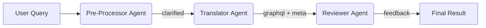

# Multi-Agent Orchestration Guide – Pre-Process → Translate → Review

> This document explains **how to run several LLMs as cooperating "agents"** to improve the NL→GraphQL translation flow.  
> You will learn what each agent does, where the code lives, how to change models, and see runnable examples.

---

## 1. Why Multi-Agent?

| Challenge | Single-Model Limitation | Multi-Agent Solution |
|-----------|------------------------|----------------------|
| Ambiguous user queries           | Model guesses intent | **Pre-Processor Agent** rewrites/clarifies the question.
| Prompt injection via history     | Hard to detect        | **Security Agent** (optional) can screen past prompts.
| Imperfect GraphQL generation     | Needs manual review   | **Reviewer Agent** critiques & suggests fixes.
| Separation of concerns           | One giant prompt      | Each agent focuses on a *single* sub-task with its own prompt & model.

---

## 2. Files Involved

| File | Purpose |
|------|---------|
| `backend/services/agent_orchestration_service.py` | Chains the agents & returns a rich result object. |
| `backend/services/translation_service.py` | Existing NL→GraphQL translator used by the **Translator Agent**. |
| `backend/services/ollama_service.py` | Low-level wrapper over Ollama (works for all agents). |
| `config/settings.py` | Holds default model names; can add specific keys like `pre_model`, `review_model`. |

---

## 3. Agent Pipeline



1. **Pre-Processor** – rewrites, expands abbreviations, resolves pronouns, etc.
2. **Translator** – generates GraphQL using the existing logic.
3. **Reviewer** – looks at original query *and* produced GraphQL; returns pass/fail, confidence tweak, suggestions.

> You can insert extra agents (e.g. security, schema-checker) by extending the service.

---

## 4. How It Works in Code

```python
# High-level call
result = await AgentOrchestrationService().process_query(
    "How many new users last month?",
    pre_model="phi3",
    translator_model="llama2",
    review_model="mistral"
)
```

The returned object:

```json
{
  "original_query": "How many new users last month?",
  "rewritten_query": "Provide the count of users who signed up in the previous calendar month.",
  "translation": {
    "graphql_query": "query { … }",
    "confidence": 0.83,
    "warnings": []
  },
  "review": {
    "passed": true,
    "comments": ["Field names align with intent", "No obvious security risks"],
    "suggested_sql": null
  }
}
```

---

## 5. Extending / Tweaking

| Want to change… | Edit This |
|-----------------|-----------|
| Default models per agent | `.env` → `PRE_MODEL=…` / Update `AgentOrchestrationService.__init__` |
| Pre-processor rules | `_build_pre_prompt()` in `agent_orchestration_service.py` |
| Reviewer scoring / JSON schema | `_build_review_prompt()` and parsing logic |
| Insert new agent | Add method + call inside `process_query()` |

---

## 6. Rebuild From Scratch (7-Step Recipe)

1. **LLM wrapper** – single class that can `chat_completion()` any model.
2. **Define agents** – tiny helper methods, each with its own prompt.
3. **Orchestrator** – async method that calls agents in sequence, passing artefacts along.
4. **Dataclasses** – neat return types (clarity > speed).
5. **FastAPI route** – e.g. `POST /multi-translate` → orchestrator.
6. **Frontend tweaks** – show extra reviewer feedback.
7. **Metrics** – broadcast each agent interaction (see `_broadcast_interaction`).

---

## 7. Running the Example

```bash
# Inside the repo root
python scripts/multi_agent_demo.py
```

You should see pretty-printed JSON similar to the object above.

---

**Happy orchestrating!** 