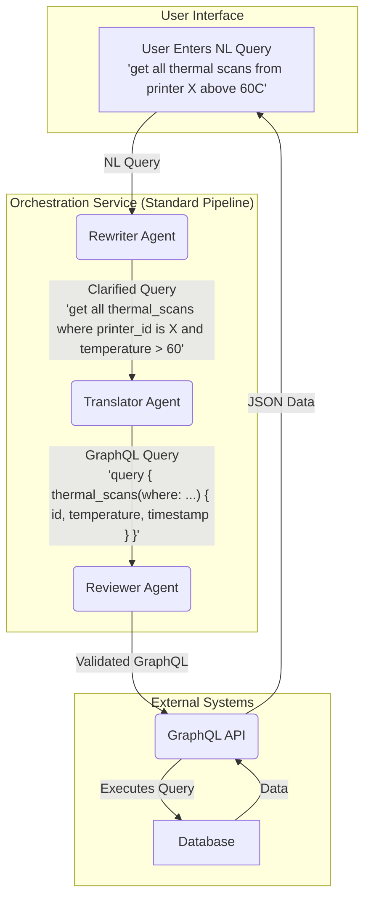

# Enhanced Agent & Pipeline Configuration Guide

This guide provides a comprehensive overview of how to configure, customize, and extend the enhanced multi-agent system in the MPPW-MCP framework.

## 1. System Architecture Overview

The system is designed with a modular and extensible architecture, consisting of several key components:

-   **Agents**: Independent, specialized components that perform specific tasks (e.g., rewriting, translating, reviewing).
-   **Pipelines**: Define the sequence and logic of how agents work together to process a query.
-   **Context Engineering**: Manages the information (prompts, history, data) provided to agents.
-   **Orchestration Service**: The central coordinator that executes pipelines and manages the overall workflow.
-   **Plugin System**: Allows for dynamic loading and integration of new capabilities, tools, and resources.

---

## 2. Agent Configuration

Agents are the fundamental building blocks of the system. You can easily modify existing agents or create new ones.

### Modifying Existing Agents

Agent implementations are located in `backend/agents/implementations.py`.

To modify an agent, such as changing its behavior or the model it uses:

1.  **Open the file**: `backend/agents/implementations.py`.
2.  **Locate the agent**: Find the class for the agent you want to change (e.g., `RewriterAgent`, `TranslatorAgent`).
3.  **Update the logic**: Modify the `process` method to change its core behavior.
4.  **Change metadata**: Update the `@agent_registry.register(...)` decorator to change its name, description, or capabilities.

**Example: Changing the RewriterAgent's model**

```python
# In backend/agents/implementations.py

@agent_registry.register(
    name="sophisticated_rewriter",
    # ... other metadata
)
class RewriterAgent(BaseAgent):
    async def process(self, context: AgentContext) -> AgentContext:
        # Change the model used for rewriting
        ollama_service = OllamaService(model="new-rewriter-model:latest")
        # ... rest of the logic
```

### Creating a New Agent

1.  **Define the class**: In `backend/agents/implementations.py`, create a new class that inherits from `BaseAgent`.
2.  **Implement the `process` method**: This method contains the agent's logic. It takes an `AgentContext` object and should return a modified `AgentContext`.
3.  **Register the agent**: Add the `@agent_registry.register(...)` decorator above your class definition. Provide a unique `name` and a list of `capabilities`.

**Example: Creating a new "Summarizer" agent**

```python
# In backend/agents/implementations.py

from .base import BaseAgent, AgentContext, AgentCapability

@agent_registry.register(
    name="text_summarizer",
    description="Summarizes long pieces of text.",
    capabilities={AgentCapability.ANALYZE}
)
class SummarizerAgent(BaseAgent):
    async def process(self, context: AgentContext) -> AgentContext:
        input_text = context.get_input("text_to_summarize")
        
        ollama_service = OllamaService(model="phi3:mini")
        summary = await ollama_service.generate(f"Summarize this text: {input_text}")
        
        context.add_output("summary", summary)
        return context
```

---

## 3. Pipeline Configuration

Pipelines orchestrate how agents work together. You can define new pipelines or modify existing ones in the orchestration service.

### Modifying Pipeline Strategies

Pipeline logic is defined in `backend/services/enhanced_orchestration_service.py`.

1.  **Open the file**: `backend/services/enhanced_orchestration_service.py`.
2.  **Find `pipeline_configs`**: This dictionary maps strategy names (e.g., `standard`, `fast`) to their configurations.
3.  **Adjust the agent sequence**: Modify the `agents` list within a strategy's configuration to add, remove, or reorder agents.

**Example: Adding the new Summarizer to the 'comprehensive' pipeline**

```python
# In backend/services/enhanced_orchestration_service.py

class EnhancedOrchestrationService:
    def __init__(self):
        self.pipeline_configs: Dict[str, Dict] = {
            # ... other strategies
            "comprehensive": {
                "description": "Full pipeline with optimization, detailed analysis, and summarization.",
                "agents": [
                    "sophisticated_rewriter",
                    "graphql_translator",
                    "graphql_reviewer",
                    "query_optimizer",
                    "text_summarizer"  # Add the new agent here
                ],
                "execution_strategy": ExecutionStrategy.SEQUENTIAL
            },
        }
        # ...
```

---

## 4. Context & Prompt Engineering

Effective prompting is crucial for agent performance. The system uses a sophisticated context engineering system.

### Changing Prompts

Prompts are managed by the `ContextEngineering` class in `backend/agents/context.py`. Prompts are dynamically generated based on a `PromptStrategy`.

1.  **Open the file**: `backend/agents/context.py`.
2.  **Locate `PROMPT_TEMPLATES`**: This dictionary contains the Jinja2 templates for various prompts.
3.  **Modify a template**: You can change the wording, add new instructions, or include more context variables.

**Example: Modifying the "Chain of Thought" prompt for the Rewriter**

```python
# In backend/agents/context.py

PROMPT_TEMPLATES = {
    "rewriter": {
        PromptStrategy.CHAIN_OF_THOUGHT: """
Your task is to rewrite the user's query to be clearer and more specific for a downstream GraphQL translation model.
Think step-by-step:
1.  **Identify entities**: What are the key nouns or concepts (e.g., 'scans', 'printers')?
2.  **Identify properties**: What attributes or data points are requested (e.g., 'temperature', 'speed')?
3.  **Identify relationships**: How are the entities connected?
4.  **Add details**: Add any missing information that would be helpful. For example, specify a date range if not provided.
5.  **Synthesize**: Combine the above into a single, clear, rewritten query.

User Query: "{{ query }}"

**Your Thought Process:**
(self-correction and reasoning here)

**Rewritten Query:**
(final rewritten query here)
""",
        # ... other strategies
    },
    # ... other agents
}
```

### Adding New Prompt Strategies

You can add new `PromptStrategy` enums and corresponding templates to experiment with different prompting techniques.

1.  **Update Enum**: Add a new value to `PromptStrategy` in `backend/agents/context.py`.
2.  **Add Template**: Add a new entry in `PROMPT_TEMPLATES` for your new strategy.

---

## 5. Agent Interaction Diagram

The following diagram illustrates how the agents collaborate within the **Standard Pipeline** to process a user's natural language query and ultimately fetch data.



This modular architecture allows for great flexibility. By following this guide, you can easily adapt and enhance the system to meet new requirements, test different AI strategies, and build an increasingly powerful and sophisticated multi-agent application. 