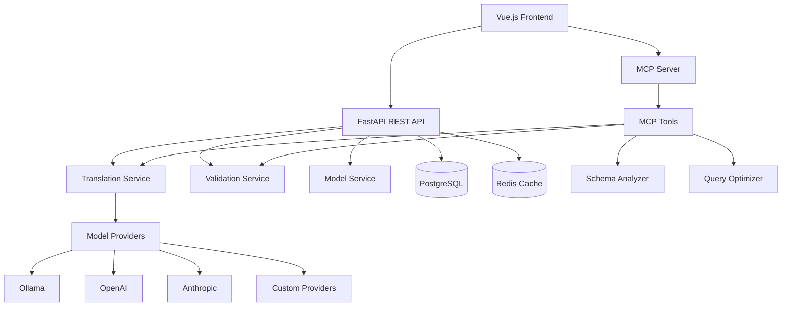

# MPPW MCP Architecture Guide

## System Overview

The MPPW MCP system provides a scalable architecture for natural language to GraphQL translation using multiple AI providers.

## Core Components

### 1. Frontend Layer (Vue.js 3)
- Real-time query translation interface
- Model switching and configuration
- Query history and management
- Schema context editing

### 2. API Gateway (FastAPI)
- RESTful endpoints with OpenAPI docs
- Request validation and rate limiting
- Health checks and monitoring
- Security middleware

### 3. MCP Server
- Model Context Protocol implementation
- Extensible tool registry
- Plugin-based architecture
- WebSocket communication

### 4. Service Layer
- **Translation Service**: NL to GraphQL conversion
- **Validation Service**: Query syntax checking
- **Model Service**: AI provider abstraction
- **Schema Service**: GraphQL introspection

### 5. Model Provider Abstraction
- Uniform interface for AI providers
- Support for Ollama, OpenAI, Anthropic, Custom
- Cost tracking and performance monitoring
- Dynamic provider switching

## Design Patterns

### Provider Pattern
```python
class BaseModelProvider(ABC):
    @abstractmethod
    async def generate(self, request: GenerationRequest) -> GenerationResponse:
        pass
```

### Plugin Architecture
```python
class ToolPlugin:
    def register_tool(self) -> ToolInfo:
        return {"name": "tool_name", "handler": self.handle, "schema": {...}}
```

### Template System
Customizable prompts with Jinja2 templates for different domains and models.

## Extensibility Points

### Adding Model Providers
1. Implement `BaseModelProvider` interface
2. Register with `ModelProviderFactory`
3. Add configuration settings

### Adding MCP Tools
1. Create tool handler function
2. Define tool schema
3. Register via plugin system

### Custom Prompt Templates
1. Create Jinja2 templates
2. Register with `PromptManager`
3. Use in translation service

## Configuration
- Environment-based settings with Pydantic
- Runtime configuration updates
- Feature flags and A/B testing support

## Security & Performance
- Rate limiting and input validation
- Multi-level caching (Redis, DB, File)
- Async architecture throughout
- Comprehensive monitoring and logging



## Configuration Management

### Environment-Based Configuration
```python
class Settings(BaseSettings):
    # Core settings
    database: DatabaseSettings
    redis: RedisSettings
    api: APISettings
    
    # Provider settings
    ollama: OllamaSettings
    openai: OpenAISettings
    anthropic: AnthropicSettings
    
    # Custom settings
    custom: CustomSettings
    
    class Config:
        env_file = ".env"
```

### Runtime Configuration
- Model switching without restart
- Dynamic prompt template loading
- Feature flags for experimental features
- A/B testing configuration

## Security Architecture

### API Security
- Rate limiting per IP/user
- Input validation and sanitization
- CORS configuration
- Authentication middleware (ready for implementation)

### Model Provider Security
- API key management
- Request/response logging
- Cost monitoring and limits
- Provider-specific security policies

### Data Security
- Database connection encryption
- Sensitive data masking in logs
- Query sanitization before storage
- User data isolation

## Performance Considerations

### Caching Strategy
```python
# Multi-level caching
L1_CACHE = "Redis"        # Fast access, 1-hour TTL
L2_CACHE = "Database"     # Persistent storage
L3_CACHE = "File System"  # Large schemas and templates
```

### Async Architecture
- Non-blocking I/O throughout
- Connection pooling for databases
- Background task processing
- Streaming responses for large results

### Optimization Techniques
- Query result caching
- Schema precompilation
- Model response caching
- Prompt template compilation

## Monitoring and Observability

### Metrics Collection
- Request/response times
- Model usage and costs
- Translation accuracy
- Error rates and types

### Logging Strategy
```python
# Structured logging with context
logger.info(
    "Translation completed",
    query_type="user_search",
    model="gpt-3.5-turbo",
    confidence=0.89,
    processing_time=1.23
)
```

### Health Checks
- Service-level health endpoints
- Dependency health monitoring
- Performance threshold alerting
- Automatic failover capabilities

## Deployment Architecture

### Development Environment
```yaml
# docker-compose.yml
services:
  backend:
    build: ./backend
    environment:
      - ENV=development
  frontend:
    build: ./frontend
  ollama:
    image: ollama/ollama
  postgres:
    image: postgres:15
  redis:
    image: redis:7-alpine
```

### Production Considerations
- Horizontal scaling with load balancers
- Container orchestration (Kubernetes)
- Database clustering and replication
- CDN for frontend assets
- Monitoring and alerting stack

## Data Flow

### Query Translation Flow
1. User enters natural language query
2. Frontend sends request to API
3. API validates and routes to Translation Service
4. Translation Service selects appropriate model provider
5. Provider generates GraphQL query
6. Validation Service checks query syntax
7. Result cached and returned to user
8. Query and result stored for history/analytics

### Model Provider Abstraction Flow
1. Request received with provider preference
2. Provider Factory creates appropriate provider instance
3. Request transformed to provider-specific format
4. Provider API called with authentication
5. Response normalized to common format
6. Costs and metrics tracked
7. Response returned to caller

## Testing Strategy

### Unit Testing
- Service layer logic
- Model provider implementations
- Validation rules
- Prompt template rendering

### Integration Testing
- API endpoint testing
- Database operations
- External provider integration
- MCP tool functionality

### End-to-End Testing
- Complete translation workflows
- User interface interactions
- Multi-provider scenarios
- Performance benchmarks

## Future Architecture Considerations

### Planned Enhancements
- Microservice decomposition
- Event-driven architecture
- Machine learning pipeline integration
- Multi-tenant support
- Real-time collaboration features

### Scalability Roadmap
- Auto-scaling based on demand
- Multi-region deployment
- Edge computing for low latency
- Advanced caching strategies
- Cost optimization algorithms

This architecture provides a solid foundation for building a scalable, extensible natural language to GraphQL translation system while maintaining flexibility for future enhancements and customizations. 