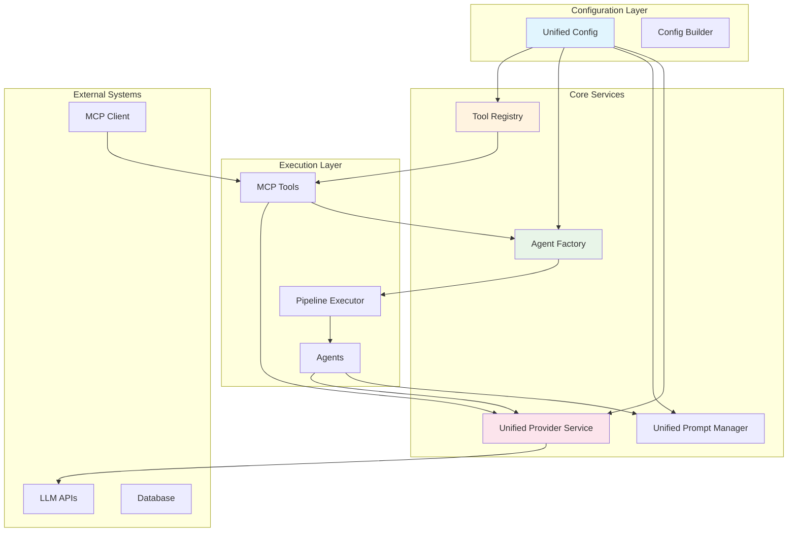
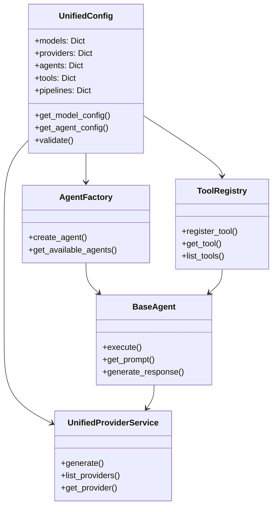

# MPPW-MCP Architecture

## Overview

The MPPW-MCP (Multi-Agent Pipeline Processing with MCP) system has been completely refactored into a unified, modular architecture that emphasizes type safety, extensibility, and maintainability. This document provides a high-level overview of the system architecture.

## Core Architecture Principles

### 1. Unified Configuration
- Single source of truth for all system configuration
- Type-safe configuration with comprehensive validation
- Easy extension for new providers, agents, and tools

### 2. Modular Design
- Loosely coupled components with well-defined interfaces
- High cohesion within modules
- Easy testing and maintenance

### 3. Extensibility
- Plugin-based architecture for easy extension
- Standardized interfaces for all components
- Configuration-driven behavior

## System Components

### Configuration Layer (`backend/config/`)

The foundation of the system, providing unified configuration management:

- **Unified Config** (`unified_config.py`): Central configuration management
- **Config Builder**: Fluent API for configuration setup
- **Type Safety**: Comprehensive dataclasses and enums

### Prompt Management (`backend/prompts/`)

Intelligent template management system:

- **Unified Prompt Manager** (`unified_prompts.py`): Template selection and rendering
- **Strategy-based Templates**: Different prompt strategies for different scenarios
- **Jinja2 Integration**: Powerful templating with validation

### Agent Framework (`backend/agents/`)

Core agent execution system:

- **Unified Agents** (`unified_agents.py`): Modern agent implementations
- **Agent Factory**: Instance creation and management
- **Pipeline Executor**: Orchestration of agent workflows
- **Legacy Support**: Backward compatibility with existing agents

### MCP Tools (`backend/mcp_server/tools/`)

MCP-compatible tool system:

- **Unified Tools** (`unified_tools.py`): Modern tool implementations
- **Tool Registry**: Automatic discovery and registration
- **MCP Integration**: Full Model Context Protocol compatibility

### Provider System (`backend/services/`)

Unified access to LLM providers:

- **Unified Providers** (`unified_providers.py`): Provider abstraction
- **Multiple Providers**: OpenAI, Ollama, Groq, OpenRouter support
- **Provider Registry**: Dynamic provider management

### API Layer (`backend/api/`)

RESTful API and routing:

- **FastAPI Server**: High-performance async API
- **Route Organization**: Modular route structure
- **Middleware**: Authentication, logging, error handling

## Data Flow

### Request Processing Flow

1. **Client Request** → API endpoint
2. **API Layer** → Pipeline Executor
3. **Pipeline Executor** → Agent Factory
4. **Agent Factory** → Specific Agent
5. **Agent** → Prompt Manager (for templates)
6. **Agent** → Provider Service (for generation)
7. **Provider Service** → External API
8. **Response** flows back through the chain

### MCP Tool Flow

1. **MCP Client** → MCP Server
2. **MCP Server** → Tool Registry
3. **Tool Registry** → Specific Tool
4. **Tool** → Core Systems (Agents, Providers, Config)
5. **Result** flows back to MCP Client

## Key Features

### Type Safety
- Comprehensive dataclasses and enums
- Runtime validation
- IDE support with full type hints

### Extensibility
- Plugin-based architecture
- Standardized interfaces
- Configuration-driven behavior

### Performance
- Async operations throughout
- Connection pooling
- Intelligent caching

### Reliability
- Comprehensive error handling
- Fallback mechanisms
- Retry logic

### Observability
- Structured logging
- Performance metrics
- Debug capabilities

## Technology Stack

### Backend
- **Python 3.11+**: Modern Python features
- **FastAPI**: High-performance web framework
- **AsyncIO**: Async programming
- **Pydantic**: Data validation
- **Jinja2**: Template engine

### Database
- **MongoDB**: Document storage
- **Neo4j**: Graph database (optional)

### LLM Providers
- **OpenAI**: GPT models
- **Ollama**: Local models
- **Groq**: Fast inference
- **OpenRouter**: Model aggregation

### Infrastructure
- **Docker**: Containerization
- **Docker Compose**: Development environment
- **Nginx**: Reverse proxy (production)

## Deployment Architecture

### Development
```
┌─────────────────┐    ┌─────────────────┐    ┌─────────────────┐
│   Frontend      │    │   Backend       │    │   External      │
│   Vue.js        │◄──►│   FastAPI       │◄──►│   APIs          │
│   Port 5173     │    │   Port 8000     │    │   OpenAI/Ollama │
└─────────────────┘    └─────────────────┘    └─────────────────┘
                               │
                       ┌─────────────────┐
                       │   Database      │
                       │   MongoDB       │
                       │   Port 27017    │
                       └─────────────────┘
```

### Production
```
┌─────────────────┐    ┌─────────────────┐    ┌─────────────────┐
│   Load Balancer │    │   Application   │    │   External      │
│   Nginx         │◄──►│   Containers    │◄──►│   Services      │
│   Port 80/443   │    │   FastAPI+Vue   │    │   Cloud APIs    │
└─────────────────┘    └─────────────────┘    └─────────────────┘
                               │
                       ┌─────────────────┐
                       │   Database      │
                       │   Managed DB    │
                       │   MongoDB Atlas │
                       └─────────────────┘
```

## Security Considerations

### API Security
- JWT-based authentication
- Rate limiting
- Request validation
- CORS configuration

### Data Protection
- Environment-based secrets
- Encrypted connections
- Input sanitization
- Output validation

### Provider Security
- Secure API key management
- Request/response filtering
- Connection timeouts
- Error message sanitization

## Migration Strategy

The new architecture maintains backward compatibility while providing clear migration paths:

### Phase 1: Parallel Systems
- New unified components alongside legacy ones
- Gradual feature migration
- Configuration bridge between systems

### Phase 2: Integration
- Legacy endpoints using new backend
- Unified configuration adoption
- Tool modernization

### Phase 3: Cleanup
- Legacy code removal
- Documentation updates
- Performance optimization

## Monitoring and Observability

### Logging
- Structured JSON logging
- Correlation IDs for request tracking
- Different log levels for different environments

### Metrics
- Request/response times
- Error rates
- Provider performance
- Resource utilization

### Health Checks
- API endpoint health
- Database connectivity
- External service availability
- Resource monitoring

## Future Enhancements

### Planned Features
- **Advanced Pipeline Orchestration**: Complex workflow support
- **Real-time Processing**: WebSocket support for streaming
- **Enhanced Security**: OAuth2, role-based access control
- **Multi-tenancy**: Support for multiple organizations
- **Advanced Analytics**: Usage analytics and insights

### Extension Points
- **Custom Agents**: Plugin system for custom agent types
- **Custom Providers**: Easy integration of new LLM providers
- **Custom Tools**: MCP-compatible tool development
- **Custom Pipelines**: Visual pipeline builder

## Documentation

- **[Unified Architecture Guide](UNIFIED_ARCHITECTURE_GUIDE.md)**: Detailed implementation guide
- **[Configuration Guide](CONFIGURATION.md)**: Configuration management
- **[Usage Guide](USAGE_GUIDE.md)**: End-user documentation
- **[Examples](EXAMPLES.md)**: Code examples and use cases

## Visual Architecture

### System Overview



### Component Relationships



This architecture provides a solid foundation for building scalable, maintainable, and extensible AI agent systems while maintaining the flexibility to adapt to future requirements. 