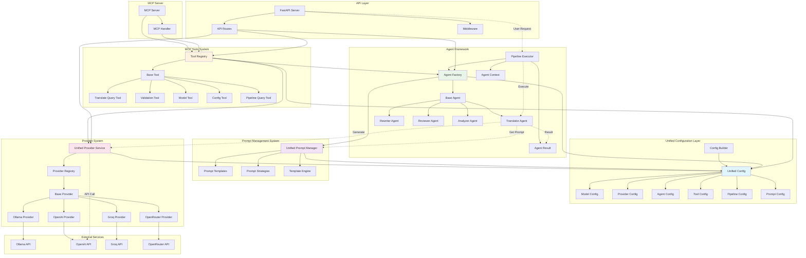
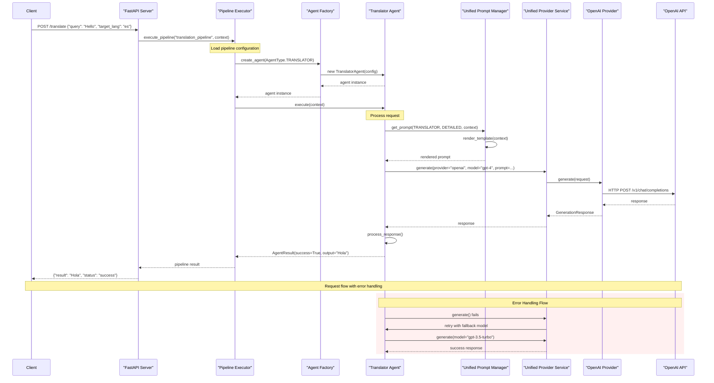
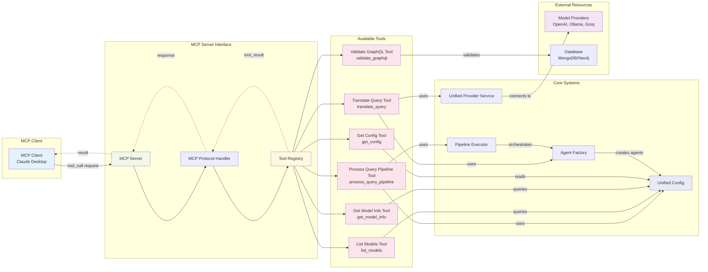

# Unified Architecture Guide

## Overview

The MPPW-MCP system has been completely refactored into a unified, modular architecture that emphasizes type safety, extensibility, and maintainability. This guide covers the new architecture and how to work with it.

## Core Principles

### 1. Unified Configuration
- **Single Source of Truth**: All configuration is managed through `backend/config/unified_config.py`
- **Type Safety**: Comprehensive dataclasses and enums ensure type safety
- **Easy Extension**: Adding new providers, agents, or tools requires minimal configuration

### 2. Standardized Interfaces
- **Consistent Patterns**: All components follow the same interface patterns
- **Predictable Behavior**: Every component implements standard methods and properties
- **Easy Testing**: Standardized interfaces make testing straightforward

### 3. Modular Design
- **Loose Coupling**: Components can work independently
- **High Cohesion**: Related functionality is grouped together
- **Clear Boundaries**: Well-defined interfaces between components

## Architecture Components

### Unified Configuration System (`backend/config/unified_config.py`)

The configuration system is the foundation of the new architecture:

```python
from backend.config.unified_config import get_config

# Get the global configuration
config = get_config()

# Access specific configurations
model_config = config.get_model_config("gpt-4")
agent_config = config.get_agent_config(AgentType.TRANSLATOR)
tool_config = config.get_tool_config("translate_query")
```

#### Key Components:

- **Enums**: AgentType, AgentCapability, ModelProvider, ModelSize, PipelineStrategy, PromptStrategy, ToolCategory
- **Configuration Classes**: ModelConfig, ProviderConfig, AgentConfig, ToolConfig, PipelineConfig, PromptConfig
- **Main Class**: UnifiedConfig with registration and access methods
- **Builder**: ConfigBuilder for fluent configuration setup

### Standardized Prompt System (`backend/prompts/unified_prompts.py`)

The prompt system provides intelligent template management:

```python
from backend.prompts.unified_prompts import get_prompt_manager

prompt_manager = get_prompt_manager()

# Get a prompt for a specific agent and strategy
prompt = prompt_manager.get_prompt(
    agent_type=AgentType.TRANSLATOR,
    strategy=PromptStrategy.DETAILED,
    context={"source_language": "en", "target_language": "es"}
)
```

#### Features:

- **Template Engine**: Jinja2-based templating with validation
- **Strategy Selection**: Different prompt strategies (detailed, minimal, chain-of-thought)
- **Context Integration**: Dynamic context injection
- **Validation**: Template syntax and variable validation

### Unified Agent Framework (`backend/agents/unified_agents.py`)

The agent framework provides consistent agent behavior:

```python
from backend.agents.unified_agents import AgentFactory, PipelineExecutor

# Create an agent
agent = AgentFactory.create_agent(AgentType.TRANSLATOR)

# Execute a pipeline
executor = PipelineExecutor()
result = await executor.execute_pipeline(
    pipeline_name="translation_pipeline",
    context=AgentContext(query="Hello world", session_id="session_123")
)
```

#### Key Components:

- **AgentContext**: Data flow management with session tracking
- **AgentResult**: Standardized execution results
- **BaseAgent**: Abstract base class with consistent interface
- **Concrete Agents**: RewriterAgent, TranslatorAgent, ReviewerAgent, AnalyzerAgent
- **AgentFactory**: Instance creation and management
- **PipelineExecutor**: Pipeline orchestration

### Modernized MCP Tools (`backend/mcp_server/tools/unified_tools.py`)

The tools system provides MCP-compatible functionality:

```python
from backend.mcp_server.tools.unified_tools import get_tool_registry

registry = get_tool_registry()

# Get a tool
tool = registry.get_tool("translate_query")

# Execute the tool
result = await tool.execute({"query": "Hello", "target_lang": "es"})
```

#### Features:

- **ToolRegistry**: Automatic discovery and registration
- **BaseTool**: Consistent tool interface
- **MCP Integration**: Full MCP server compatibility
- **Comprehensive Tools**: Translation, validation, model management, configuration

### Streamlined Provider System (`backend/services/unified_providers.py`)

The provider system offers unified access to different LLM providers:

```python
from backend.services.unified_providers import get_provider_service

provider_service = get_provider_service()

# Generate text
response = await provider_service.generate(
    provider_name="openai",
    model="gpt-4",
    prompt="Translate this text...",
    max_tokens=150
)
```

#### Features:

- **BaseProvider**: Abstract provider interface
- **Multiple Providers**: Ollama, OpenAI-compatible (Groq, OpenRouter, etc.)
- **ProviderRegistry**: Provider management
- **UnifiedProviderService**: Single interface for all providers
- **Easy Extension**: Simple provider addition

## Implementation Patterns

### Adding a New Agent

1. **Define Agent Type** (if new):
```python
# In backend/config/unified_config.py
class AgentType(Enum):
    TRANSLATOR = "translator"
    REWRITER = "rewriter"
    REVIEWER = "reviewer"
    ANALYZER = "analyzer"
    NEW_AGENT = "new_agent"  # Add this
```

2. **Create Agent Class**:
```python
# In backend/agents/unified_agents.py
class NewAgent(BaseAgent):
    def __init__(self, config: UnifiedConfig):
        super().__init__(config, AgentType.NEW_AGENT)
    
    async def execute(self, context: AgentContext) -> AgentResult:
        # Implementation here
        pass
```

3. **Register in Factory**:
```python
# In AgentFactory.create_agent method
if agent_type == AgentType.NEW_AGENT:
    return NewAgent(config)
```

4. **Add Prompts**:
```python
# In backend/prompts/unified_prompts.py
# Add templates for the new agent
```

### Adding a New Provider

1. **Create Provider Class**:
```python
# In backend/services/unified_providers.py
class NewProvider(BaseProvider):
    def __init__(self, config: ProviderConfig):
        super().__init__(config)
    
    async def generate(self, request: GenerationRequest) -> GenerationResponse:
        # Implementation here
        pass
```

2. **Register Provider**:
```python
# In get_provider_service function
registry.register_provider("new_provider", NewProvider(provider_config))
```

### Adding a New Tool

1. **Create Tool Class**:
```python
# In backend/mcp_server/tools/unified_tools.py
class NewTool(BaseTool):
    def __init__(self, config: UnifiedConfig):
        super().__init__("new_tool", "Description", ToolCategory.PROCESSING, config)
    
    async def execute(self, params: Dict[str, Any]) -> ToolResult:
        # Implementation here
        pass
```

2. **Auto-Registration**: The tool will be automatically registered by the ToolRegistry

## Configuration Examples

### Basic Configuration Setup

```python
from backend.config.unified_config import ConfigBuilder, get_config

# Build configuration
builder = ConfigBuilder()

# Add models
builder.add_model("gpt-4", ModelProvider.OPENAI, ModelSize.LARGE, ["translation", "rewriting"])
builder.add_model("llama3:8b", ModelProvider.OLLAMA, ModelSize.MEDIUM, ["analysis"])

# Add providers
builder.add_provider("openai", ModelProvider.OPENAI, {"api_key": "your-key"})
builder.add_provider("ollama", ModelProvider.OLLAMA, {"base_url": "http://localhost:11434"})

# Add agents
builder.add_agent(AgentType.TRANSLATOR, ["translation"], "gpt-4", PromptStrategy.DETAILED)

# Add tools
builder.add_tool("translate_query", ToolCategory.TRANSLATION, {"max_length": 1000})

# Add pipelines
builder.add_pipeline("translation_pipeline", [AgentType.TRANSLATOR], PipelineStrategy.SEQUENTIAL)

# Build and set as global
config = builder.build()
```

### Advanced Configuration

```python
# Custom agent configuration
agent_config = AgentConfig(
    agent_type=AgentType.TRANSLATOR,
    capabilities=[AgentCapability.TRANSLATION, AgentCapability.VALIDATION],
    primary_model="gpt-4",
    fallback_models=["gpt-3.5-turbo", "llama3:8b"],
    prompt_strategy=PromptStrategy.CHAIN_OF_THOUGHT,
    max_retries=3,
    timeout=30,
    custom_settings={"temperature": 0.3, "max_tokens": 1000}
)

config.register_agent_config(agent_config)
```

## Testing

The unified architecture makes testing straightforward:

```python
import pytest
from backend.config.unified_config import ConfigBuilder
from backend.agents.unified_agents import AgentFactory, AgentContext

@pytest.fixture
def test_config():
    builder = ConfigBuilder()
    # Add test configuration
    return builder.build()

@pytest.mark.asyncio
async def test_translator_agent(test_config):
    agent = AgentFactory.create_agent(AgentType.TRANSLATOR, test_config)
    context = AgentContext(query="Hello world", session_id="test")
    
    result = await agent.execute(context)
    
    assert result.success
    assert result.output
```

## Migration from Legacy System

The new system maintains backward compatibility while providing migration paths:

1. **Gradual Migration**: Use new components alongside existing ones
2. **Configuration Bridge**: Legacy configurations can be converted to new format
3. **Interface Compatibility**: Existing interfaces are preserved where possible

## Best Practices

### Configuration Management
- Use the global configuration instance for consistency
- Register all configurations at startup
- Use environment variables for sensitive data
- Validate configurations early

### Agent Development
- Always extend BaseAgent for consistency
- Implement proper error handling
- Use the context system for data flow
- Add comprehensive logging

### Tool Development
- Follow the BaseTool interface
- Ensure MCP compatibility
- Add proper parameter validation
- Document tool capabilities

### Provider Integration
- Implement BaseProvider interface
- Handle provider-specific errors gracefully
- Add retry logic for reliability
- Monitor provider performance

## Performance Considerations

### Caching
- Prompt templates are cached after first load
- Configuration is cached at startup
- Provider instances are reused

### Async Operations
- All operations are async where possible
- Proper connection pooling for providers
- Batch operations when beneficial

### Resource Management
- Proper cleanup of resources
- Connection pooling for databases
- Memory management for large operations

## Troubleshooting

### Common Issues

1. **Configuration Errors**: Check configuration validation
2. **Provider Connection Issues**: Verify provider settings and connectivity
3. **Prompt Template Errors**: Validate template syntax and variables
4. **Agent Execution Failures**: Check logs for detailed error information

### Debugging

- Use the built-in logging system
- Enable debug mode for detailed output
- Use the configuration validation tools
- Monitor performance metrics

## Future Extensions

The architecture is designed for easy extension:

- **New Agent Types**: Add to AgentType enum and implement agent class
- **New Providers**: Implement BaseProvider interface
- **New Tools**: Extend BaseTool for MCP compatibility
- **New Strategies**: Add to PromptStrategy enum and implement templates
- **Custom Pipelines**: Use PipelineConfig for complex workflows

## Architecture Diagrams

### System Architecture Overview



### Request Processing Flow



### MCP Tool Interactions



This unified architecture provides a solid foundation for scalable, maintainable, and extensible AI agent systems. 